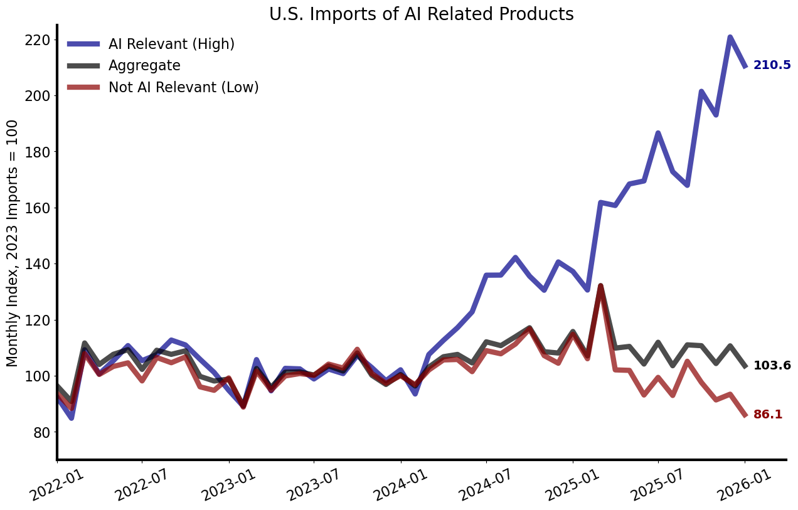
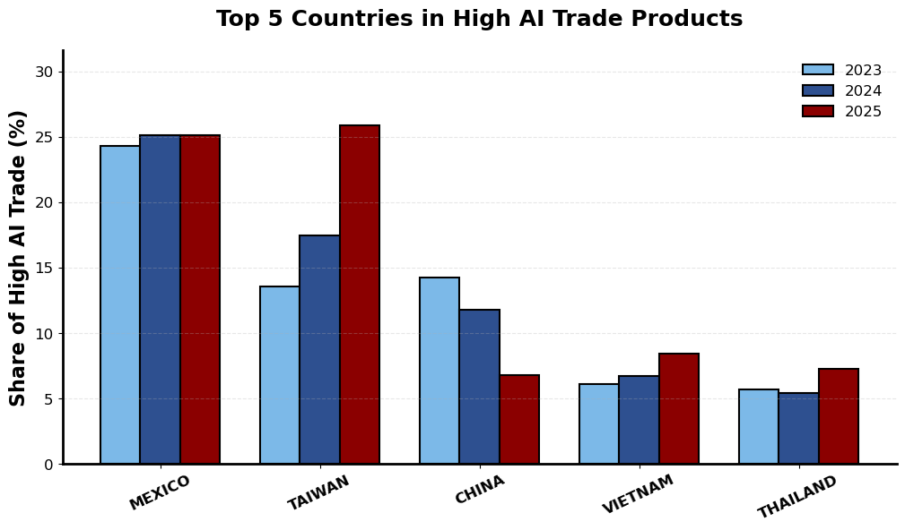
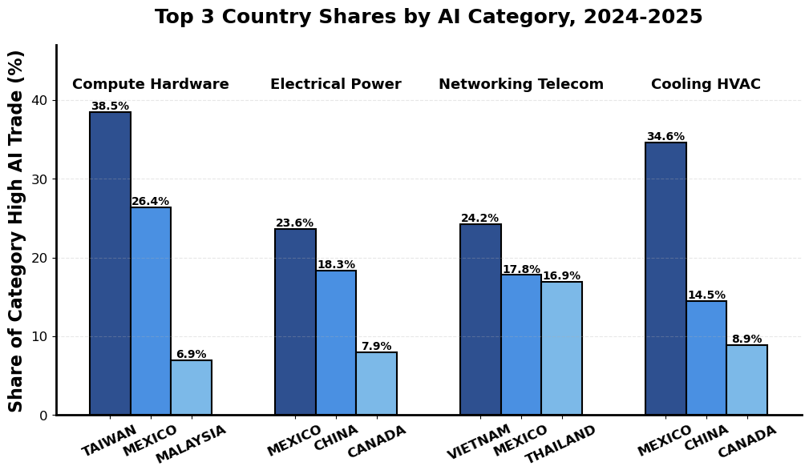
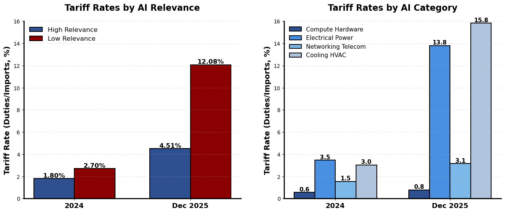
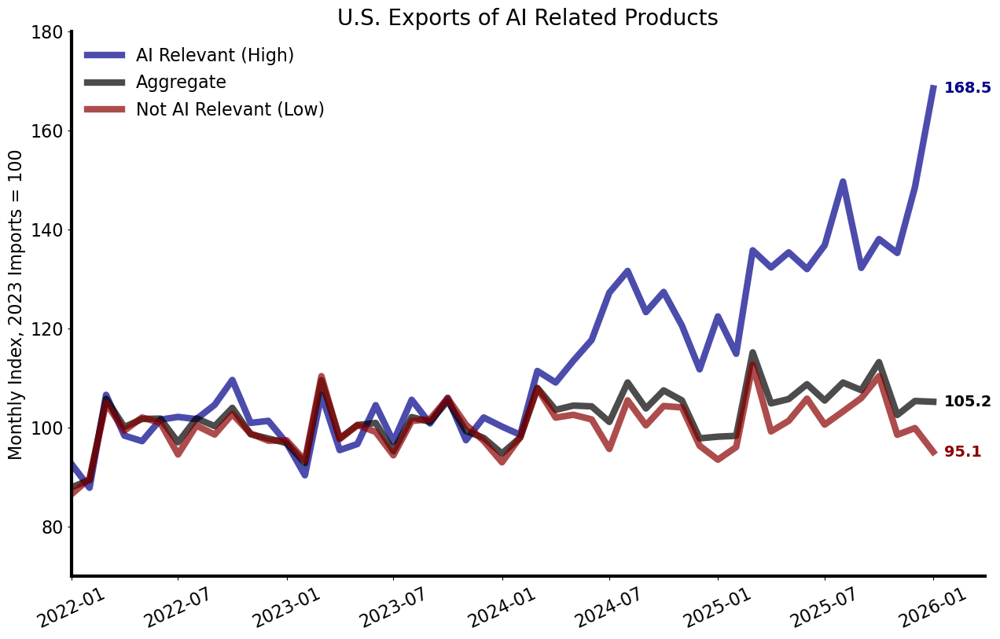
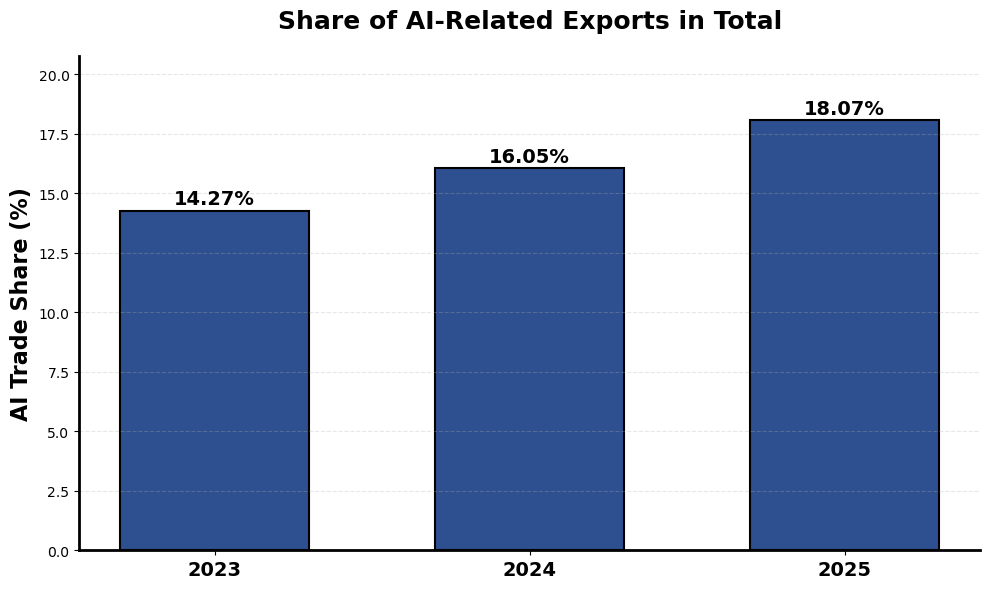
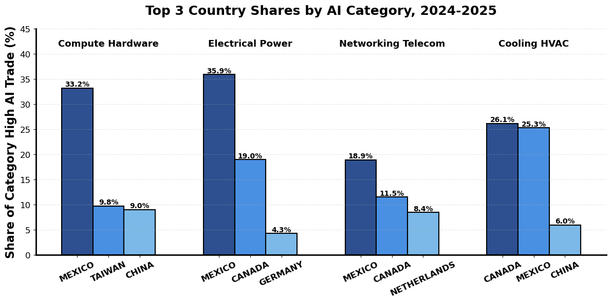

# Trade in AI-Related Products

**Abstract.** This paper documents facts about international trade in AI-related products. I develop a large language model (LLM) classification tool that maps HS10 codes in U.S. trade data to inputs used in the construction and operation of AI infrastructure. AI-related products account for 23 percent of U.S. imports in 2025, and these products have grown by 73 percent since 2023. Over this same time period, non-AI-related products have grown by only 3 percent, with the divergence between the two categories beginning in early 2024. U.S. exports of AI-related products have been abnormally strong as well. Mexico is a key market for both the import and export side, and along with Taiwan these two countries account for about half of all AI trade. A simple accounting exercise suggests that the U.S. goods trade deficit would have been nearly $200 billion smaller in 2025 absent trade in AI-related products.

> **Citation:** If you use or quote this data, please cite as:
>
> Waugh, Michael E. "Trade in AI-Related Products." Working Paper, Federal Reserve Bank of Minneapolis, March 2026.

---

This document walks through the key findings from the analysis of U.S. trade in AI-related products. The analysis uses an LLM-based classification tool to identify which of the roughly 18,364 HS10 commodity codes in U.S. trade data are related to AI data center infrastructure. The classification methodology is documented in [HS10_CLASSIFIER_DOCUMENTATION.md](HS10_CLASSIFIER_DOCUMENTATION.md), and a full listing of high-relevance products is available in [AI_TRADE_HIGH_RELEVANCE_PRODUCTS.md](AI_TRADE_HIGH_RELEVANCE_PRODUCTS.md). Trade data comes from the U.S. Census Bureau and covers monthly flows from 2013 through January 2026.

---

## 1. What Are AI-Related Products?

The LLM classifier assigns each HS10 code a relevance level (High, Medium, or Low) and a product category. The baseline analysis focuses on products classified as **High** relevance --- those directly used in data center construction or operation. The table below summarizes the classification.

### U.S. Import Values by AI Relevance and Category (2023 vs 2025)

| Category | # HS10 Codes | 2023 ($B) | 2025 ($B) | Change (%) |
|---|---:|---:|---:|---:|
| **High AI Relevance** | **645** | **379.0** | **654.0** | **+72.6** |
| &nbsp;&nbsp;&nbsp;&nbsp;Compute Hardware | 163 | 144.4 | 353.8 | +144.9 |
| &nbsp;&nbsp;&nbsp;&nbsp;Electrical Power | 250 | 116.9 | 141.8 | +21.3 |
| &nbsp;&nbsp;&nbsp;&nbsp;Networking Telecom | 24 | 62.9 | 99.5 | +58.2 |
| &nbsp;&nbsp;&nbsp;&nbsp;Cooling HVAC | 137 | 41.5 | 47.5 | +14.4 |
| &nbsp;&nbsp;&nbsp;&nbsp;Building Structure | 44 | 12.1 | 10.1 | -16.5 |
| &nbsp;&nbsp;&nbsp;&nbsp;Fire Safety Security | 8 | 0.6 | 0.7 | +10.5 |
| &nbsp;&nbsp;&nbsp;&nbsp;Specialty Materials | 19 | 0.4 | 0.5 | +22.5 |
| Low AI Relevance | 15,915 | 1,834.7 | 1,880.9 | +2.5 |
| **Total Trade** | **18,364** | **2,598.3** | **2,883.9** | **+11.0** |

Compute Hardware accounts for over half of all high-relevance AI trade, driven by GPUs, servers, and memory modules. But the classification also captures a broader set of products --- electrical power equipment, networking gear, and cooling systems --- that together make up the other half. Growth is broad-based: five of seven categories show double-digit import growth.

### Top 10 High-Relevance Products by 2025 Import Volume

| HS10 Code | Description | Category | 2025 Imports ($B) | Share (%) | Change (%) |
|---|---|---|---:|---:|---:|
| 8471500150 | Data processing units | Compute Hardware | 163.55 | 5.67 | +343.0 |
| 8517620090 | Telecom transmission/reception equipment | Networking Telecom | 52.88 | 1.83 | +58.3 |
| 8473301180 | Printed circuit assemblies for data processing | Compute Hardware | 48.89 | 1.70 | +199.8 |
| 8517620020 | Switching and routing apparatus | Networking Telecom | 30.76 | 1.07 | +89.1 |
| 8473301140 | Memory modules for data processing | Compute Hardware | 25.77 | 0.89 | +205.6 |
| 8523510000 | Solid-state non-volatile storage devices (SSDs) | Compute Hardware | 17.54 | 0.61 | +84.6 |
| 7403110000 | Refined copper cathodes | Electrical Power | 16.64 | 0.58 | +150.3 |
| 8507600020 | Lithium-ion storage batteries | Electrical Power | 16.53 | 0.57 | +11.1 |
| 8537109170 | Electrical switchgear (<1000V) | Electrical Power | 11.30 | 0.39 | +12.9 |
| 8471804000 | Units for incorporation into data processing machines | Compute Hardware | 11.14 | 0.39 | +936.5 |

The top 10 list is dominated by compute hardware and networking equipment, but also includes copper cathodes (a key input for electrical wiring), lithium-ion batteries (for UPS backup systems), and switchgear. All ten products show double-digit growth; five show triple-digit growth rates since 2023.

---

## 2. The Spectacular Growth of AI-Related Trade

### Import Growth Index (2023 = 100)

This is the central result. The blue line shows imports of AI-relevant (High) products indexed to 2023 monthly averages. As of January 2026, the AI-relevant index stands at **211** --- meaning import volumes are more than double the typical month in 2023. By contrast, non-AI-relevant products (red line) have an index of **86**, meaning they have actually contracted. The aggregate index (black) is at **104**, and this modest overall growth is entirely a byproduct of the AI boom.

The timing is notable: through early 2024, AI and non-AI products tracked each other closely. The divergence begins in mid-2024 and accelerates sharply through 2025.

### AI Share of Total U.S. Imports

AI-related products have grown from **15%** of total imports in 2023 to **17%** in 2024 and **23%** in 2025 --- an increase of 8 percentage points in two years. Nearly a quarter of all U.S. imports are now AI-related.

---

## 3. Mexico and Taiwan Are Dominant Sources

### Top Sources of AI-Related Products

Mexico and Taiwan each account for roughly a quarter of all high-relevance AI trade. Mexico's prominence is perhaps the most surprising finding --- it has consistently held about 25% market share across all years. Taiwan's role is more expected given its dominance in semiconductor manufacturing, and its share has been increasing through 2025.

Mexico's role in AI trade also helps explain a puzzle in USMCA commerce: despite facing essentially the same tariff treatment as Canada in 2025, U.S. imports from Mexico grew by 6.4% while imports from Canada fell by 8.3%. The difference is partly driven by 40.7% growth in Mexican AI-related exports to the U.S. China has declined in importance, falling from a position comparable to Taiwan in 2023 to a level similar to Vietnam and Thailand.

### Top Sources by Product Category

Mexico leads in two of the top four product categories and ranks second in every other. Taiwan's prominence is concentrated in Compute Hardware, where it is the leading source.

---

## 4. Tariffs Are Lower on AI-Related Products

Effective tariff rates (duties as a share of import value) are substantially lower on AI-related products than on other goods:

| Relevance | 2024 Tariff (%) | 2025 Tariff (%) |
|---|---:|---:|
| High AI Relevance | 1.8 | 4.7 |
| Low AI Relevance | 2.7 | 9.4 |

By category in 2025: Compute Hardware faces just 1.1%, while Electrical Power (11.0%) and Cooling HVAC (11.3%) face higher rates. Networking Telecom is at 4.0%. While tariffs rose across the board in 2025, AI-related products remain relatively less protected.

---

## 5. U.S. Exports of AI-Related Products

The export side tells a complementary story --- U.S. exporters play an important role in the global AI value chain.

### U.S. Export Values by AI Relevance and Category (2023 vs 2025)

| Category | # HS10 Codes | 2023 ($B) | 2025 ($B) | Change (%) |
|---|---:|---:|---:|---:|
| **High AI Relevance** | **534** | **221.5** | **297.9** | **+34.5** |
| &nbsp;&nbsp;&nbsp;&nbsp;Compute Hardware | 112 | 99.1 | 160.6 | +62.1 |
| &nbsp;&nbsp;&nbsp;&nbsp;Electrical Power | 219 | 64.5 | 70.1 | +8.8 |
| &nbsp;&nbsp;&nbsp;&nbsp;Networking Telecom | 23 | 29.1 | 37.7 | +29.7 |
| &nbsp;&nbsp;&nbsp;&nbsp;Cooling HVAC | 128 | 24.1 | 25.0 | +3.5 |
| &nbsp;&nbsp;&nbsp;&nbsp;Building Structure | 28 | 3.0 | 2.8 | -6.8 |
| &nbsp;&nbsp;&nbsp;&nbsp;Specialty Materials | 16 | 0.7 | 0.6 | -9.6 |
| &nbsp;&nbsp;&nbsp;&nbsp;Fire Safety Security | 7 | 0.5 | 0.6 | +13.4 |
| Low AI Relevance | 8,278 | 1,034.8 | 1,058.6 | +2.3 |
| **Total Trade** | **9,269** | **1,551.9** | **1,648.4** | **+6.2** |

AI-related exports grew 34.5% since 2023, led by Compute Hardware (+62.1%). While import growth is stronger (reflecting the U.S. as a net importer of AI products), the export side confirms that AI trade is not one-sided.

### Export Growth Index (2023 = 100)

The export-side pattern mirrors the import side: AI-relevant exports have diverged sharply from non-AI exports since mid-2024.

### AI Share of Total U.S. Exports

### Top Export Destinations by Product Category

---

## 6. Counterfactual: AI's Impact on the Trade Deficit

A simple accounting exercise asks: what would the U.S. goods trade balance have been if AI-related products had grown at the same rate as non-AI products since 2023?

The construction proceeds in four steps:

**Step 1: Non-AI growth index.** Let $M_t^{\text{non}}$ denote non-AI (Low relevance) imports in month $t$, and $\bar{M}_{2023}^{\text{non}}$ the average monthly level in 2023. The non-AI growth index is:

$$g_t^{M} = \frac{M_t^{\text{non}}}{\bar{M}_{2023}^{\text{non}}}$$

with $g_t^{M} = 1$ on average in 2023 by construction. Define $g_t^{X}$ analogously for exports.

**Step 2: Counterfactual AI series.** Let $M_t^{\text{AI}}$ be actual AI imports and $\bar{M}_{2023}^{\text{AI}}$ the 2023 average AI level. The counterfactual asks: what if AI imports had grown from the same 2023 base, but at the non-AI rate?

$$\widetilde{M}_t^{\text{AI}} = \bar{M}_{2023}^{\text{AI}} \cdot g_t^{M}, \qquad \widetilde{X}_t^{\text{AI}} = \bar{X}_{2023}^{\text{AI}} \cdot g_t^{X}$$

**Step 3: Excess AI trade.** The AI boom contribution to each flow is the gap between actual and counterfactual:

$$E_t^{M} = M_t^{\text{AI}} - \widetilde{M}_t^{\text{AI}}, \qquad E_t^{X} = X_t^{\text{AI}} - \widetilde{X}_t^{\text{AI}}$$

**Step 4: Counterfactual trade balance.** Let $B_t = X_t - M_t$ denote the actual goods trade balance (negative = deficit). The counterfactual balance replaces AI flows with their counterfactual levels, leaving non-AI flows unchanged:

$$\widetilde{B}_t = B_t + E_t^{M} - E_t^{X}$$

The AI boom widens the deficit when excess imports exceed excess exports ($E_t^M > E_t^X$). The term $E_t^M - E_t^X$ measures the net contribution of the AI boom to the trade deficit.

### Accounting for AI's Impact on Trade ($B)

| Year | Actual Imports | Actual Exports | Excess AI Imports | Excess AI Exports | Net Effect |
|---|---:|---:|---:|---:|---:|
| 2023 | 2,598 | 1,552 | --- | --- | --- |
| 2024 | 2,792 | 1,601 | 66 | 33 | +32 |
| 2025 | 2,884 | 1,648 | 265 | 71 | +194 |

The actual U.S. goods trade deficit in 2025 was **$1,235 billion**. If AI-related products had grown no faster than other goods, the deficit would have been **$1,041 billion** --- nearly **$194 billion** smaller. The AI data center buildout is a first-order force behind the widening of the U.S. goods trade deficit.

---

## Data and Code

All figures and tables are generated by the numbered Jupyter notebooks in this repository:

| Notebook | Section |
|---|---|
| 01--05 | Data collection and LLM classification |
| 06 | Product classification tables |
| 07 | Import growth index and shares |
| 08 | Country-level import analysis |
| 09 | Tariff analysis |
| 10 | Export-side analysis |
| 11 | Counterfactual trade balance |
| 12 | Robustness checks |

Trade data comes from the U.S. Census Bureau's international trade statistics. Classification uses the Claude API to evaluate each HS10 code's relevance to AI data center infrastructure.
